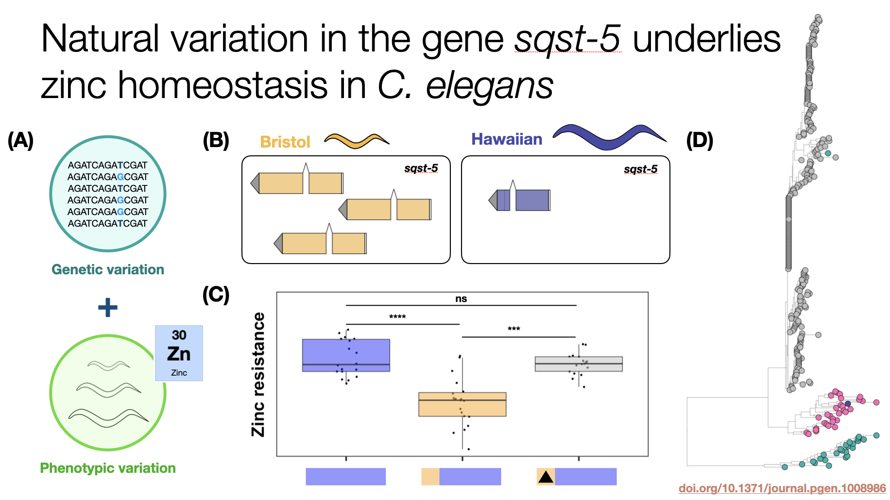

For a brief snippet of my graduate research, my primary project was trying to identify genetic variants that caused zinc resistance or sensitivity in the nematode *C. elegans* (**A**). In a statistical analysis by correlating genetic variation and variation in zinc sensitivities across hundreds of strains, I identified four regions of the genome of significant interest. 

At the most significant locus, I methodically narrowed down a list of candidate genes from 120 to 1 (*sqst-5*) using genetic crosses, a statistical method called mediation analysis (which essentially identifies genes with expression variation that might contribute to my zinc sensitivity phenotype (**B**)), and, eventually, CRISPR/Cas9 genome editing to prove causal association (**C**). 

Finally, I was able to show that structural variation in the gene sqst-5 was found commonly throughout the *C. elegans* population (**D**) and was also correlated with resistance in these strains, suggesting a natural context for the evolution of zinc response mechanisms.

#### Check out my [publications]("publications.md") to learn more about my graduate research!